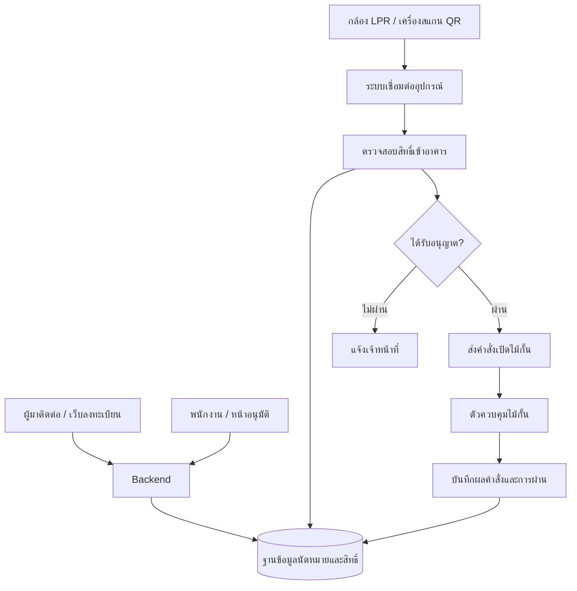

# Flowchart ระบบเข้าอาคาร

```mermaid
flowchart TD
    A["ผู้มาติดต่อ / เว็บลงทะเบียน"] --> B["Backend"]
    C["พนักงาน / หน้าอนุมัติ"] --> B
    B --> D[("ฐานข้อมูลนัดหมายและสิทธิ์")]

    E["กล้อง LPR / เครื่องสแกน QR"] --> F["ระบบเชื่อมต่ออุปกรณ์"]
    F --> G["ตรวจสอบสิทธิ์เข้าอาคาร"]
    G --> D
    G --> H{"ได้รับอนุญาต?"}
    H -->|"ผ่าน"| I["ส่งคำสั่งเปิดไม้กั้น"]
    H -->|"ไม่ผ่าน"| J["แจ้งเจ้าหน้าที่"]
    I --> K["ตัวควบคุมไม้กั้น"]
    K --> L["บันทึกผลคำสั่งและการผ่าน"]
    L --> D
```
