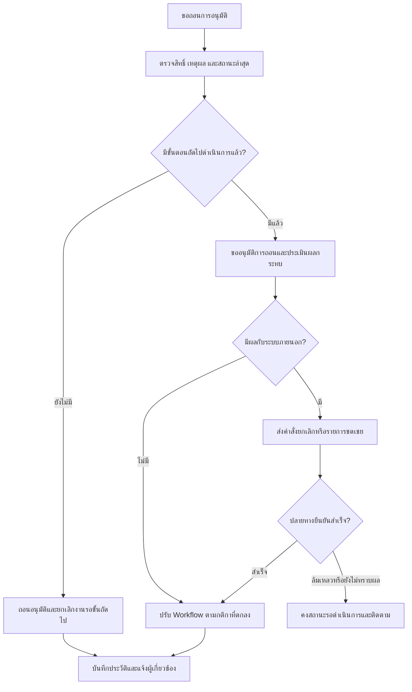

# Flowchart การถอนการอนุมัติ

```mermaid
flowchart TD
    A["ขอถอนการอนุมัติ"] --> B["ตรวจสิทธิ์ เหตุผล และสถานะล่าสุด"]
    B --> C{"มีขั้นตอนถัดไปดำเนินการแล้ว?"}
    C -->|"ยังไม่มี"| D["ถอนอนุมัติและยกเลิกงานรอขั้นถัดไป"]
    C -->|"มีแล้ว"| E["ขออนุมัติการถอนและประเมินผลกระทบ"]
    E --> F{"มีผลกับระบบภายนอก?"}
    F -->|"ไม่มี"| G["ปรับ Workflow ตามกติกาที่ตกลง"]
    F -->|"มี"| H["ส่งคำสั่งยกเลิกหรือรายการชดเชย"]
    H --> I{"ปลายทางยืนยันสำเร็จ?"}
    I -->|"สำเร็จ"| G
    I -->|"ล้มเหลวหรือยังไม่ทราบผล"| J["คงสถานะรอดำเนินการและติดตาม"]
    D --> K["บันทึกประวัติและแจ้งผู้เกี่ยวข้อง"]
    G --> K
```
